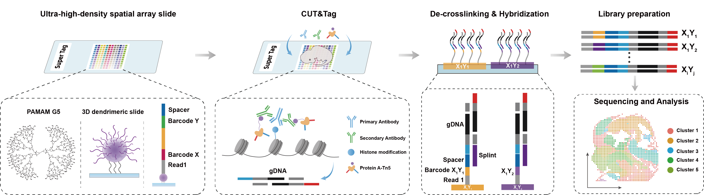

# Guide for SUPER-Tag data process




## 1. Select Spots Using DynamicST Assist

For detailed instructions, please refer to the [DynamicST Assist GitHub repository](https://github.com/DynamicBiosystems/DynamicST-Assist).

---

## 2. Set Up the Environment

```bash
# Install the required Python version and pigz
conda install python=3.10 pigz -y

# Install necessary Python packages
pip install biopython opencv-python pandas
```

### Download Cell Ranger ATAC and Reference Data

Please visit the [10x Genomics Cell Ranger ATAC Downloads Page](https://www.10xgenomics.com/support/software/cell-ranger-atac/downloads)


Replace barcode file (737K-cratac-v1.txt.gz) in /PATH/TO/cellranger-atac-2.1.0/lib/python/atac/barcodes

---

## 3. Run the Analysis

```÷÷bash
python spatial.py \
    --r1 Sample_L5_1.fq.gz \
    --r2 Sample_L5_2.fq.gz \
    --sample Sample \
    --outdir /PATH/TO/OUTDIR \
    --image Sample_registedimage.tif \
    --alignment Sample_result.json \
    --barcode 0_8_38_46_101 \
    --cores 32 \
    --cratac /PATH/TO/cellranger-atac-2.1.0/bin/cellranger-atac \
    --refdata /PATH/TO/refdata-cellranger-arc-mm10-2020-A-2.0.0
```
